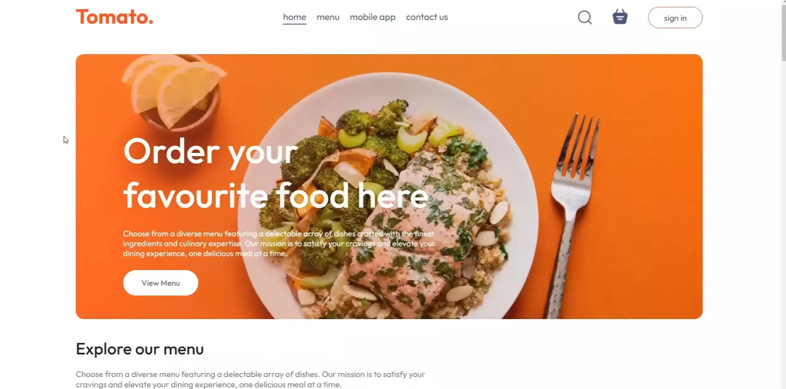

# 🍔 ByteBites – Full Stack Food Delivery Website




#### YT Vedio :=> [ByteBites YT Uploads](https://youtube.com/playlist?list=PLa1XRahOdH1qYyBoUtRE5iuuOiMoRzdYB&si=SgwTTGHegg8I4B0o)

## 📌 Project Description

**ByteBites** is a **Full Stack Food Delivery Web Application** built using the **MERN Stack (MongoDB, Express.js, React.js, Node.js)** with **Stripe payment integration**.

The platform allows users to browse food items, add them to their cart, place orders, and pay securely online. It also includes a **separate admin panel** where administrators can manage food items and track orders.

---

# 🚀 Key Features

### 👤 User Side

* Browse food menu
* Filter food by category
* Add / Remove items from cart
* Secure user authentication
* Place food orders
* Stripe payment integration
* View order history
* Responsive UI

### 🛠️ Admin Panel

* Add new food items
* Upload food images
* Manage food list
* View customer orders
* Update order status

---

# 🧰 Tech Stack

### Frontend

* React.js
* React Router
* Context API
* CSS
* Axios

### Backend

* Node.js
* Express.js

### Database

* MongoDB
* Mongoose

### Authentication

* JWT (JSON Web Token)
* bcrypt password hashing

### Payment

* Stripe Payment Gateway

---

# 📂 Project Folder Structure

```bash
ByteBites
│
├── admin
│   └── src
│       ├── assets
│       ├── components
│       │   ├── Navbar
│       │   └── Sidebar
│       │
│       ├── pages
│       │   ├── Add
│       │   ├── List
│       │   └── Orders
│       │
│       ├── App.jsx
│       ├── index.css
│       └── main.jsx
│
├── backend
│   ├── config
│   │   └── db.js
│   │
│   ├── controllers
│   │   ├── cartController.js
│   │   ├── foodController.js
│   │   ├── orderController.js
│   │   └── userController.js
│   │
│   ├── middleware
│   │   └── auth.js
│   │
│   ├── models
│   │   ├── foodModel.js
│   │   ├── orderModel.js
│   │   └── userModel.js
│   │
│   └── server.js
│
├── frontend
│   └── src
│       ├── assets
│       │
│       ├── components
│       │   ├── AppDownload
│       │   ├── ExploreMenu
│       │   ├── FoodDisplay
│       │   ├── FoodItem
│       │   ├── Footer
│       │   ├── Header
│       │   ├── LoginPopup
│       │   └── Navbar
│       │
│       ├── Context
│       │   └── StoreContext.jsx
│       │
│       ├── pages
│       │   ├── Cart
│       │   ├── Home
│       │   ├── MyOrders
│       │   ├── PlaceOrder
│       │   └── Verify
│       │
│       ├── App.jsx
│       ├── index.css
│       └── main.jsx
│
└── README.md
```

---

# 🗄️ Database Models

## 🍔 Food Model

```javascript
const foodSchema = new mongoose.Schema({
  name: {type:String, required:true},
  description: {type:String, required:true},
  price: {type:Number, required:true},
  image: {type:String, required:true},
  category: {type:String, required:true}
})
```

---

## 👤 User Model

```javascript
const userSchema = new mongoose.Schema({
  name:{type:String,required:true},
  email:{type:String,required:true,unique:true},
  password:{type:String,required:true},
  cartData:{type:Object,default:{}},
},{minimize:false})
```

---

## 📦 Order Model

```javascript
const orderSchema = new mongoose.Schema({
  userId:{type:String,required:true},
  items:{type:Array,required:true},
  amount:{type:Number,required:true},
  address:{type:Object,required:true},
  status:{type:String,default:"Food Processing"},
  date:{type:Date,default:Date.now()},
  payment:{type:Boolean,default:false}
})
```

---

# ⚙️ Installation & Setup

## 1️⃣ Clone Repository

```bash
git clone https://github.com/sam-in07/bytebites.git
cd bytebites
```

---

# Backend Setup

```bash
cd backend
npm install
```

Create `.env`

```
PORT=4000
MONGO_URI=your_mongodb_connection
JWT_SECRET=your_secret
STRIPE_SECRET_KEY=your_stripe_key
```

Run backend server

```bash
npm run server
```

---

# Frontend Setup

```bash
cd frontend
npm install
npm run dev
```

---

# Admin Panel Setup

```bash
cd admin
npm install
npm run dev
```

---

# 💳 Stripe Payment Integration

ByteBites uses **Stripe Payment Gateway** to handle secure transactions.

Stripe is used for:

* Creating checkout sessions
* Processing payments
* Verifying payment status
* Updating order status after payment

---

# 📡 API Endpoints

## User APIs

```
POST /api/user/register
POST /api/user/login
```

## Food APIs

```
GET /api/food/list
POST /api/food/add
DELETE /api/food/remove
```

## Cart APIs

```
POST /api/cart/add
POST /api/cart/remove
POST /api/cart/get
```

## Order APIs

```
POST /api/order/place
POST /api/order/verify
GET /api/order/userorders
GET /api/order/list
POST /api/order/status
```

---

# 🔒 Security

* JWT Authentication
* Password Hashing with bcrypt
* Protected API Routes
* Stripe Secure Payments

---

# 📸 Screenshots

You can add screenshots here:

```
/screenshots/home.png
/screenshots/menu.png
/screenshots/cart.png
/screenshots/payment.png
/screenshots/admin.png
```

---

# 👨‍💻 Author

**Developer:** Samin
**Project:** ByteBites – MERN Food Delivery App

GitHub:
[chainsamino07](https://github.com/sam-in07)
---

# 📄 License

This project is licensed under the **MIT License**.


................
npm create vite@latest
https://fonts.google.com/specimen/Outfit 

rafce 
------------------